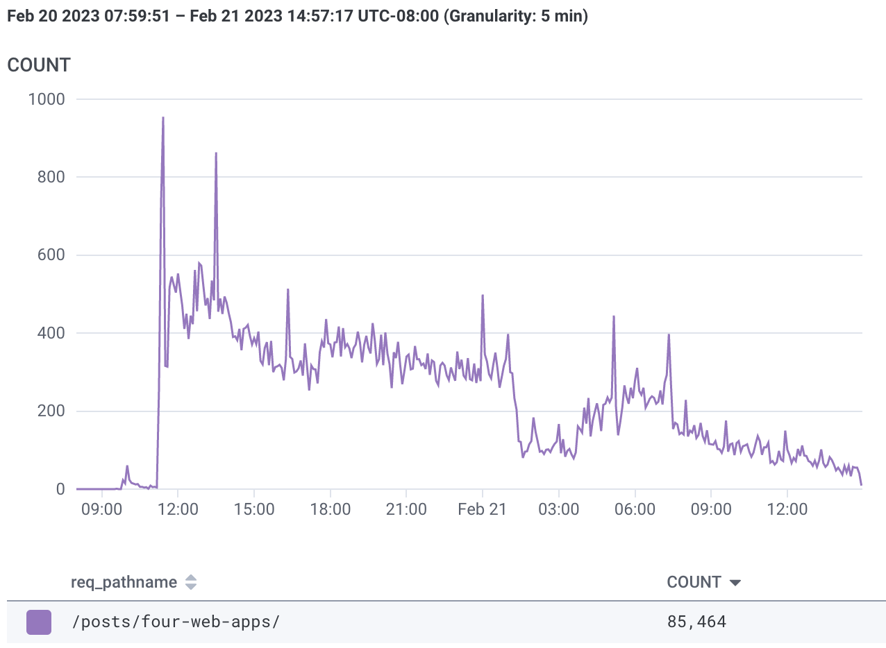

I [wrote a blog post][0] about two weeks ago. I hit publish on February 20, 2023 at [9:30am Pacific -0800][2]. I submitted it to Hacker News [at 9:45am][1]. What happened over the next 24 hours astonished me. 

## Traffic to 'Four Ways to Build Web Apps', Feb 20-21

I had no idea any of this was happening. I checked in at 7pm (10 hours after submission) expecting to see no interest. First I saw my karma had rocketed up. Then, I saw the upvotes and comments which made it clear what was happening.

How did I get this data? To run my blog I'm using a combination of Option 1 (Static Website) and Option 2 (Edge Functions). I use cloudflare workers functions to add HTTP security headers and write analytics to Honeycomb.  

I'm on the $5/mo cloudflare workers plan and the billing period ending March 4, I used less than 1.5MM of the included 10MM monthly workers bundled (<50ms) requests. 

  [0]: https://tomhummel.com/posts/four-web-apps/
  [1]: https://news.ycombinator.com/item?id=34870636
  [2]: https://github.com/tphummel/blog/pull/87
