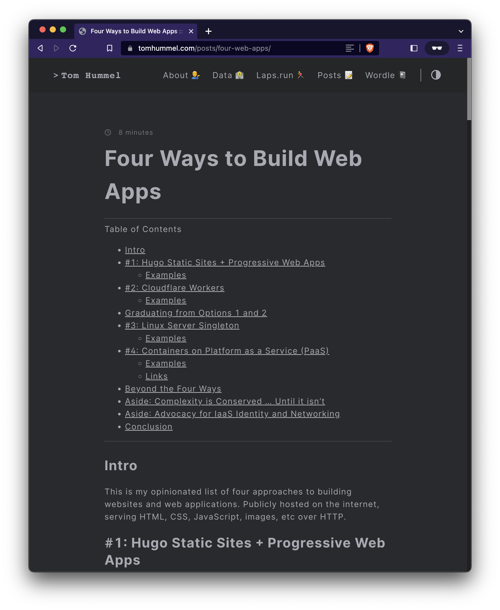
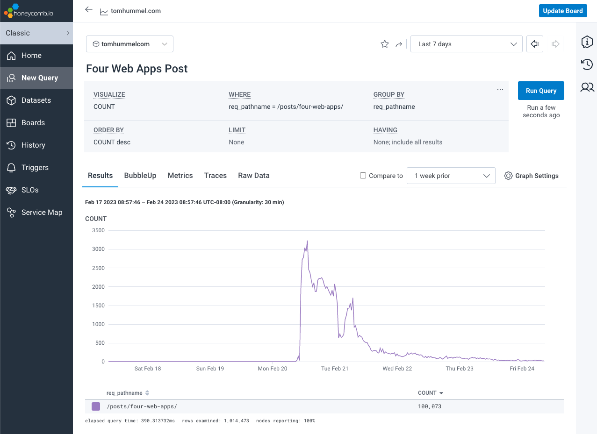
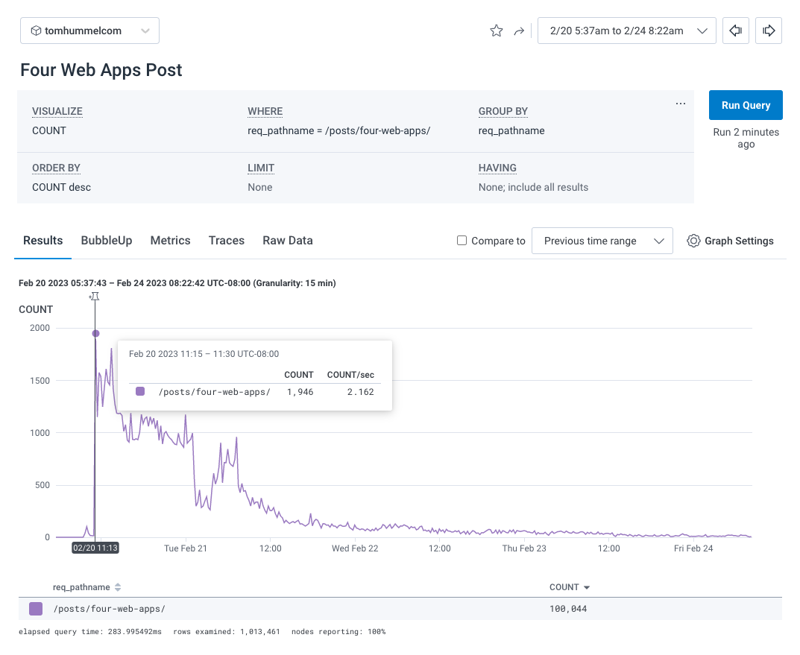
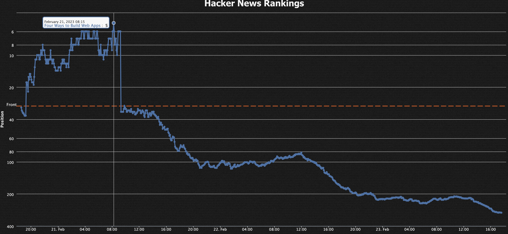

## Intro

I wrote [a blog post]() in February 2023 which was by far the most popular thing I've personally put on the internet. 

## Highlights

- 80,000 pageviews in first 16 hours.
- Avg of 1+ request per second in each of 14 consecutive hours: 11:00AM PT 2/20 until 1:00 AM PT 2/21. 
- On the Hacker News frontpage for 12 hours.
- Peaked at Hacker News #5 slot.
- HN: 307 upvotes, 121 comments.

## Timeline

- 2/20
    - 17:30 UTC - [Published blog post](https://github.com/tphummel/blog/pull/87)
    - 17:45 UTC - [Submitted the link on HN](https://news.ycombinator.com/item?id=34870636)
    - 19:20 UTC - [Post entered Hacker News front page](https://hnrankings.info/34870636/)
- 2/21
    - 09:20 UTC - Post exited HN front page
    - 09:30 UTC - 80,000 cumulative pageviews reached
- 2/24
    - 20:00 UTC - 100,000 cumulative pageviews reached

## Charts

### Pageviews Overview

### Pageviews Zoomed

### Hacker News Ranking

## Technical Details

My blog ([Tomhummel.com](https://tomhummel.com)) is a static website built with [Hugo](https://gohugo.io), hosted on [Cloudflare Pages](https://pages.cloudflare.com/) (Way #1), augmented with a Cloudflare Worker (Way #2). [The worker](https://github.com/tphummel/blog/blob/main/workers/index.js) intercepts each request, sends analytics data to [Honeycomb](https://honeycomb.io), and sets two security headers on the response. 

The tools available on Honeycomb are what unlocked the analysis in this post. Coarse grained data was available on Cloudflare but not sufficient to do everything.

## Regrets

- I wish I didn’t link my fork of the [nomie repo](https://github.com/open-nomie/nomie6-oss) as the post drove a handful of Github stars to my fork. I’m not doing development on the fork and I’m afraid it will create confusion for people who discover the project going forward.
- I would have created more specificity around option #3, the Linux VM singleton. This was an intentional choice. Some comments seemed to think I meant one or more linux servers. No, I meant precisely one linux server with a SQLite database file sitting on the linux filesystem. This creates a number of other efficiencies when you have exactly one VM. 

## Data

| 60 minutes starting | req / second | http request count | cumulative total |
| --- | --- | --- | --- |
| 2/20/2023 9:00am -0800 | 0.01 | 39 | 39 |
| 10:00am -0800 | 0.05 | 171 | 210 |
| 11:00am -0800 | 1.30 | 4,681 | 4,891 |
| 12:00pm -0800 | 1.62 | 5,819 | 10,710 |
| 1:00pm -0800 | 1.71 | 6,166 | 16,876 |
| 2:00pm -0800 | 1.34 | 4,820 | 21,696 |
| 3:00pm -0800 | 1.16 | 4,177 | 25,873 |
| 4:00pm -0800 | 1.10 | 3,962 | 29,835 |
| 5:00pm -0800 | 1.12 | 4,047 | 33,882 |
| 6:00pm -0800 | 1.23 | 4,427 | 38,309 |
| 7:00pm -0800 | 1.23 | 4,412 | 42,721 |
| 8:00pm -0800 | 1.11 | 3,998 | 46,719 |
| 9:00pm -0800 | 1.09 | 3,923 | 50,642 |
| 10:00pm -0800 | 1.00 | 3,615 | 54,257 |
| 11:00pm -0800 | 1.01 | 3,645 | 57,902 |
| 2/21/2023 12:00am -0800 | 1.09 | 3,927 | 61,829 |
| 1:00am -0800 | 0.61 | 2,187 | 64,016 |
| 2:00am -0800 | 0.38 | 1,380 | 65,396 |
| 3:00am -0800 | 0.39 | 1,393 | 66,789 |
| 4:00am -0800 | 0.65 | 2,351 | 69,140 |
| 5:00am -0800 | 0.79 | 2,848 | 71,988 |
| 6:00am -0800 | 0.81 | 2,920 | 74,908 |
| 7:00am -0800 | 0.73 | 2,618 | 77,526 |
| 8:00am -0800 | 0.50 | 1,788 | 79,314 |
| 9:00am -0800 | 0.38 | 1,350 | 80,664 |

| 24 hours starting | requests / minute | http request count | cumulative total |
| --- | --- | --- | --- |
| 2/19/2023 16:00 -0800 | 17.967 | 25,873 | 25,873 |
| 2/20 16:00 -0800 | 41.806 | 60,201 | 86,074 |
| 2/21 16:00 -0800 | 6.187 | 8,909 | 94,983 |
| 2/22 16:00 -0800 | 2.863 | 4,122 | 99,105 |
| 2/23 16:00 -0800 | 0.995 | 1,433 | 100,538 |
| 2/24 16:00 -0800 | 0.649 | 935 | 101,473 |
| 2/25 16:00 -0800 | 1.021 | 1,470 | 102,943 |
| 2/26 16:00 -0800 | 1.023 | 1,473 | 104,416 |
| 2/27 16:00 -0800 | 0.549 | 791 | 105,207 |
| 2/28 16:00 -0800 | 0.359 | 517 | 105,724 |
| 3/1 16:00 -0800 | 0.306 | 440 | 106,164 |
| 3/2 16:00 -0800 | 0.259 | 373 | 106,537 |
| 3/3 16:00 -0800 | 0.242 | 349 | 106,886 |

Pct of total traffic served, by country, first 48 hours (from cloudflare)

| Country | % of Traffic |
| --- | --- |
| United States | 62.80% |
| Germany | 7.71% |
| United Kingdom | 6.52% |
| Canada | 5.12% |
| Australia | 4.06% |
| All Others Combined | 13.79% |